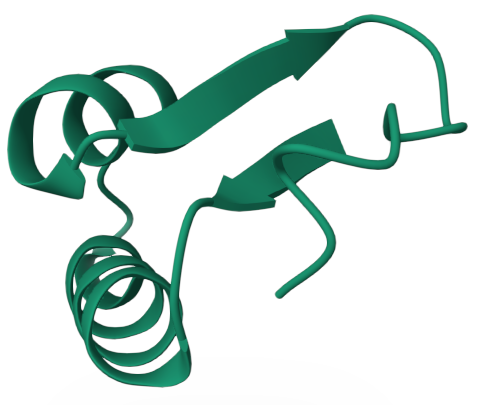

# Del ADN a la Proteína

**Bioinformática**  
Replicación, transcripción y traducción

**Autora:** Adriana Peñate Sosa

## Código del proyecto

El código se encuentra en [Bioinformatics/ADNaProteina](https://github.com/adrianapenate/Bioinformatics/blob/main/ADNaProteina/ADNaProte%C3%ADna_code.ipynb).

## Ejercicio 1. Replicación del ADN
**1.** Considera la siguiente secuencia de ADN:  5' – ATG CCG TTA GCT – 3' / 3' – TAC GGC AAT CGA – 5'.  Realiza una ronda de replicación:

**Identifica las nuevas hebras que se formarán. Indica cuál sería la función de las enzimas helicasa, primasa, ADN polimerasa y ligasa en este proceso.**

Las hebras originales se separan y sirven como molde para generar la hebra complementaria en dirección antiparalela. Considerando las reglas estrictas de que Adenina encaja con Timina y viceversa, a la vez que Citosina encaja con Guanina y viceversa, obtendríamos una nueva hebra igual a la que ya la complementaba:

- A partir de la hebra molde 5' → 3' (5'-ATG CCG TTA GCT-3'): 3'-TAC GGC AAT CGA-5'
- A partir de la hebra molde 3' → 5' (3'-TAC GGC AAT CGA-5'): 5'-ATG CCG TTA GCT-3'

Se obtienen 2 dobles hélices idénticas a la original (cada una con una hebra antigua y una nueva).

Función de las enzimas:

- Helicasa: Rompe los enlaces entre bases y abre la doble hélice de ADN
- Primasa: Sintetiza un pequeño fragmento de ARN para indicar dónde iniciar la síntesis.
- ADN Polimerasa: Lee la hebra molde y añade los nucleótidos complementarios para construir la nueva cadena.
- Ligasa: Sella los cortes y une los fragmentos sueltos de ADN para dejar la hebra continua.

**2.** Reflexiona:

**¿Qué ocurriría si la ADN polimerasa cometiera un error en una base y no se corrigiera?**

Si la ADN polimerasa comete un error (pone una base incorrecta) y este no se corrige, se produce una mutación puntual en la secuencia del ADN. Esto puede originar una proteína defectuosa, no funcional, o alterar la regulación del gen en las generaciones celulares futuras.

## Ejercicio 2. Transcripción del ADN a ARN
**1.** Usa la siguiente secuencia de ADN: 5' – ATG CCT GAA TGC – 3' / 3' – TAC GGA CTT ACG – 5':

**Identifica cuál es la cadena molde.**

La hebra molde será aquella en dirección 3' → 5', en este caso, 3' – TAC GGA CTT ACG – 5'

**Obtén el transcrito de ARN correspondiente (recuerda que el ARN se sintetiza en dirección 5' → 3' y utiliza uracilo en lugar de timina).**

Al construir el ARN en dirección 5' → 3' complementando a la contraria, la cadena molde, se obtendría una cadena como la 5' → 3' del ADN pero teniendo uracilo en vez de timina. El resultado sería 5' – AUG CCU GAA UGC – 3'.

**Explica cuál sería la región promotora y cuál la región codificante.**

La región promotora sirve como zona de reconocimiento para iniciar la transcripción y permite que se reclute la ARN polimerasa. En la secuencia proporcionada en el ejercicio no se indica explícitamente cuál es el promotor, así que no podemos identificar unas bases concretas como tal. La región codificante sería la parte del ADN que contiene la información necesaria para determinar la secuencia de aminoácidos de la proteína. En este caso, estaría representada por la secuencia 5'-ATG CCT GAA TGC-3', que dará lugar al ARNm 5'-AUG CCU GAA UGC-3'.

## Ejercicio 3. Traducción del ARNm a proteína
**1.** Usa el siguiente transcrito de ARN: 5' – AUG UAU GCU UAA – 3 ':

**Identifica el codón de inicio y codón de paro.**

El codón de inicio se encuentra en la secuencia AUG, identificándose como Metionina al traducirlo a aminoácido. El codón de paro es UAA ya que esta no añade ningún aminoácido a la proteína.

**Traduce la secuencia en una cadena de aminoácidos.**

En este ARN contemplamos AUG que corresponde a Metionina, UAU que sería Tirosina y GCU Alanina, consiguiendo una cadena de aminoácidos Met – Tyr – Ala. Como decía anteriormente, UAA indica que se detiene la traducción ya que no añade ningún aminoácido.

**2.** Reflexiona:

**¿Qué pasaría si el codón de inicio mutara de AUG a GUG? ¿Qué ocurriría si el codón de paro desapareciera por mutación?**

Cambiar AUG por GUG puede impedir el inicio de la traducción, sin producir ni obtener proteína. Sin embargo, según fuentes como el NCBI, Centro Nacional de Información Biotecnológica, aseguran haber encontrado también documentados codones de inicio alternativos en bacterias con GUG.  Si UAA deja de ser el codón de parada, la traducción continuaría hasta otro codón de parada, obteniendo una proteína más larga de lo normal.

## Ejercicio 4. Splicing alternativo
**1.** Considera un gen con 5 exones: Exón 1 – Exón 2 – Exón 3 – Exón 4 – Exón 5:

**Diseña al menos dos combinaciones de splicing alternativo (por ejemplo, 1-2-4-5 o 1-3-5).**

En la biología real, qué exones se incluyen o excluyen está regulado y depende del gen y del contexto celular. Nosotros podríamos estudiar, predecir y experimentar con el splicing alternativo, pero considerando que las combinaciones de exones obtenidas pueden no ocurrir de manera natural.  Tras esta aclaración, podríamos considerar las combinaciones 1-2-3-5 o 1-2-3-4.

**Explica qué diferencias esperarías en las proteínas resultantes.**

La diversidad de combinaciones generará diferentes ARNm y, por consecuente, se producirían proteínas con distinta secuencia de aminoácidos, longitud, estructura y función.

**2.** Reflexiona:

**¿Por qué este mecanismo aumenta la diversidad proteica sin necesidad de más genes?**

El splicing alternativo aumenta la diversidad proteica porque permite obtener diferentes ARNm a partir de un mismo gen mediante distintas combinaciones de exones. Estos ARNm pueden dar lugar a diferentes proteínas, por lo que un solo gen puede originar varias variantes proteicas sin necesidad de aumentar el número de genes.

**3.** Busca en Ensembl un gen humano conocido con isoformas (por ejemplo, FGFR2) y compara sus diferentes transcritos. Reflexiona sobre cómo estas diferencias podrían afectar a la función de la proteína.

Las diferencias entre los transcritos de FGFR2 producidos mediante splicing alternativo pueden originar distintas isoformas de la proteína. Tal y como se puede apreciar en los transcritos codificantes de proteínas, hay registros de cadenas de aminoácidos de diferente longitud. Al cambiar parte de la secuencia del receptor, puede cambiar su capacidad para reconocer diferentes factores de crecimiento puesto que provocan diferencias en una región funcional del receptor. De este modo, dos variantes podrían reconocer determinados conjuntos de moléculas diferentes. Por tanto, un mismo gen puede producir proteínas con propiedades funcionales diferentes dependiendo del splicing realizado.

## Ejercicio 5. Introducción a las proteínas
**1.** Considera la siguiente secuencia de aminoácidos: Met – Ile – Ser – Gly – Val – Lys – His:

**Identifica el extremo N y el extremo C de la cadena.**

El extremo N corresponde a la metionina (Met), siendo el primer aminoácido de la secuencia y el extremo C a la histidina (His), el último aminoácido.

**2.** Reflexiona:

**¿Cómo influye el orden de los aminoácidos en la estructura final de la proteína? ¿Qué ocurriría si hubiera una mutación que cambiara un aminoácido hidrofóbico por uno hidrofílico en una región interna de la proteína?**

Los aminoácidos no son todos iguales, tienen propiedades químicas diferentes. Cada uno interacciona de manera distinta entre sí y con el medio, haciendo que la proteína adopte determinada estructura tridimensional. El orden de los aminoácidos determina las interacciones que pueden establecerse dentro de la cadena y, por tanto, influye en su plegamiento y en la estructura tridimensional final de la proteína. Como la estructura está relacionada con la función, un cambio en la secuencia puede modificar también su función.

**3.** Busca en el Protein Data Bank (PDB) la estructura de una proteína conocida y observa cómo los aminoácidos se organizan en hélices alfa y láminas beta. Reflexiona sobre cómo una mutación puntual podría afectar al plegamiento.

Analizamos 1CRN, la proteína crambin en Protein Data Bank, una proteína vegetal pequeña de 46 aminoácidos. Al plegarse, identificamos las hélices alfa adoptando forma helicoidal, de muelle, y las láminas beta, formando estructuras extendidas asociadas entre sí.

Si se produjera una mutación puntual que sustituyera uno de los aminoácidos que participa en la estabilización de estas regiones por otro con propiedades diferentes, podrían modificarse las interacciones que mantienen la estructura de la crambin. Esto podría alterar localmente una hélice alfa o una lámina beta y, si el cambio fuera suficientemente importante, afectar al plegamiento tridimensional de la proteína.

Ilustración 1: 1CRN 3D view (<https://www.rcsb.org/3d-view/1CRN>)

## Ejercicio 6.  Actividad integradora: del ADN a la proteína
**1.** Replicación, transcripción y traducción realizada en el script.

El código está disponible en el repositorio de GitHub, en el directorio
[Bioinformatics/ADNaProteina](https://github.com/adrianapenate/Bioinformatics/tree/main/ADNaProteina).

**2.** Reflexiona:

**¿Qué punto del proceso es más vulnerable a errores que afecten a la función de la proteína?**

La replicación puede considerarse un punto especialmente crítico, ya que un error que no sea corregido puede quedar incorporado como una mutación en el ADN. Si esa mutación afecta a una región codificante, puede transmitirse posteriormente al ARNm y provocar un cambio en la secuencia de aminoácidos, pudiendo alterar la estructura y la función de la proteína.
